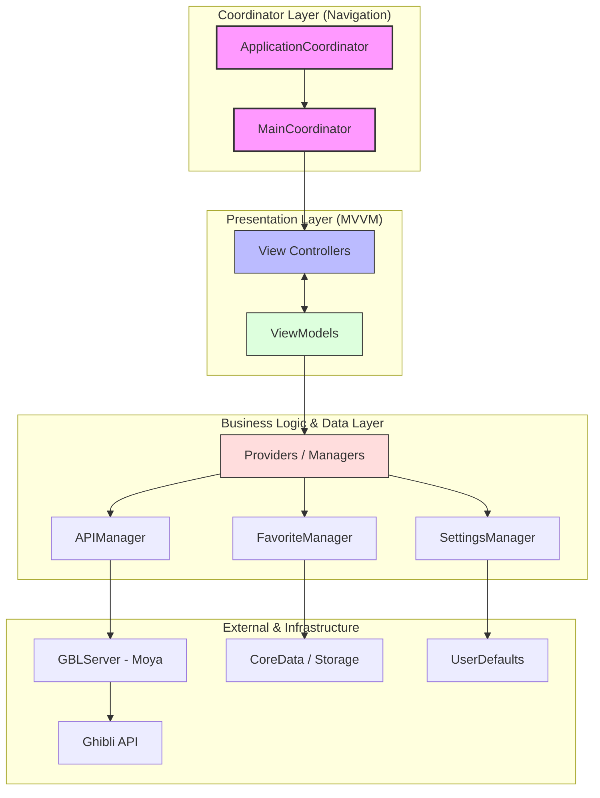
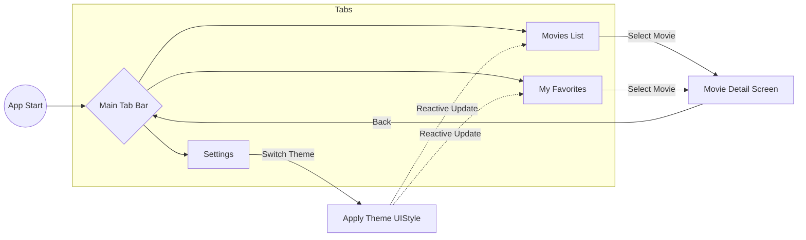
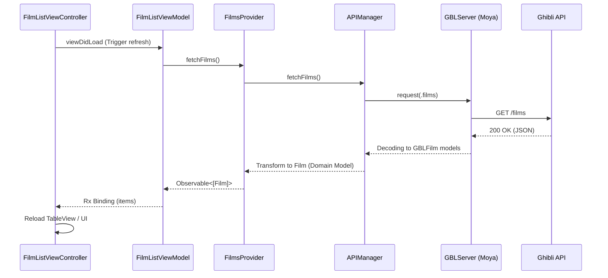

# GhibliSimpleAPIInfoDemo 專案流程圖

這份文件詳細描述了 `GhibliSimpleAPIInfoDemo` 專案的架構設計、導航流程以及資料存取邏輯。

## 1. 系統架構圖 (MVVMC)

本專案採用 **MVVM-C (Model-View-ViewModel-Coordinator)** 架構，並結合了 **RxSwift** 進行響應式開發，以及 **Moya** 處理網路請求。

---

## 2. 應用程式導航流程 (User Flow)

展示使用者從啟動應用程式到查看電影詳情的路徑。

---

## 3. 資料獲取與顯示流程 (Sequence)

以「顯示電影列表」為例，展示 **RxSwift** 資料流如何從 API 回傳至 UI。

---

## 4. 關鍵組件說明

| 組件類型 | 職責說明 |
| :--- | :--- |
| **Coordinator** | 負責處理 `UIViewController` 的初始化與導航路徑 (push/present)。 |
| **ViewModel** | 處理業務邏輯，將底層數據轉換為 View 可用的狀態，並透過 Rx 向外發布。 |
| **Provider** | 介於 ViewModel 與 Manager 之間，負責整合多個數據源（如 API + 本地快取）。 |
| **APIManager** | 網路層的統一入口，負責錯誤處理（超時、無網路）與數據解碼。 |
| **SettingsManager** | 管理全局狀態（如主題顏色），並提供 Observable 讓 View 分別訂閱。 |
