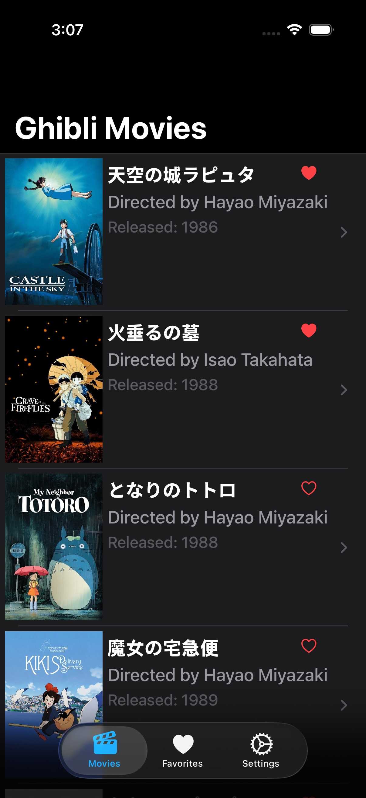
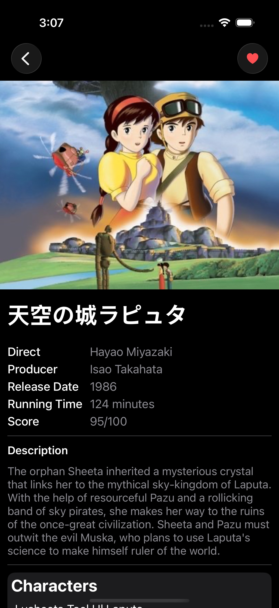
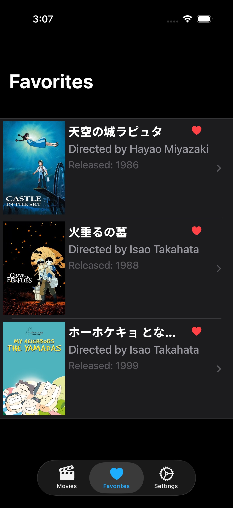
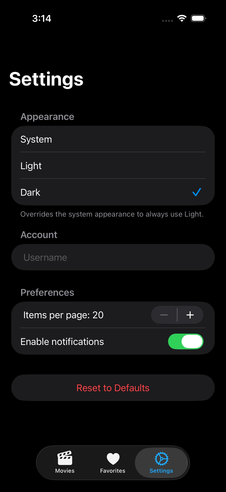
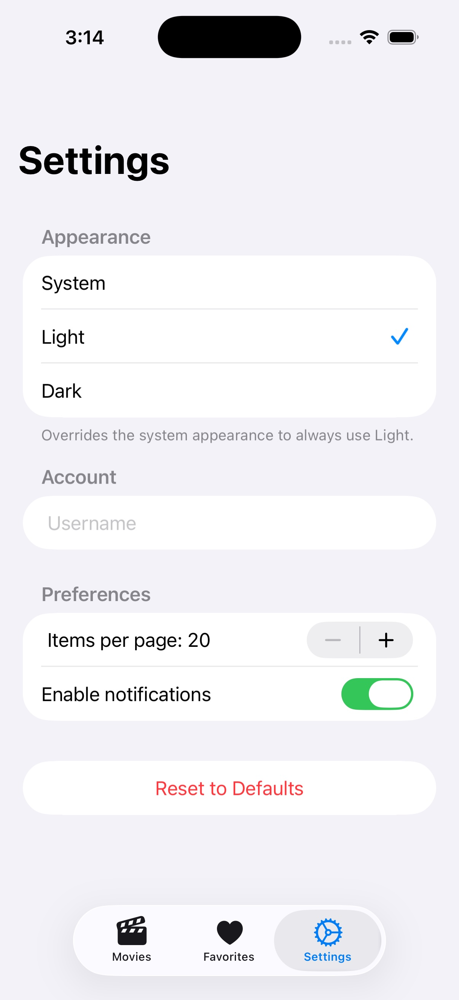

# Ghibli Simple API Info Demo

專案配置:
- 系統：iOS 18.4+
- 架構：MVVMC
- 框架：RxSwift
- 網路層：Moya

API [documentation](https://ghibliapi.vercel.app/) for Studio Ghibli:
- base URL: https://ghibliapi.vercel.app/
- endpoints: `/films`,  `/people`
- no authentication required

[流程圖](./FlowChart.md)

## Features of the Reference Project

- TabView with Navigation Stacks
- List Screen (fetch from API, show list of items).
- Detail Screen (display more info, async image loading).
  

  
   

- Favorites (local persistence).
  

- Settings (theme, stored in UserDefaults).
  

# Reference
⭐️⭐️⭐️⭐️⭐️ [GhibliSwiftUIApp](https://github.com/gahntpo/GhibliSwiftUIApp) by [Karin Prater](https://github.com/gahntpo)